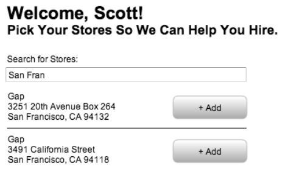

# Store Picker

This was an assignment for a job interview. 

## build/test

```
make
```


# Original Prompt

## Goal
The goal of this task is to evaluate your front end development experience. There’s no single right answer so give it your best shot.

##Task
Create a page where a user can search and select their store location. A user can only have one store location.

The page should have a single location search field that autocompletes as the user types their street, city, state, or ZIP code. When selected, the location should be associated with the current user.

When finished, please push it to a public GitHub repository and send us a link to it.

Backend API that’s available to you: 

- Get all locations
    End point: http://infinite-sands-9943.herokuapp.com/locations 
    Method: GET
    Content-Type: application/json
- Location search 
    End point: http://infinite-sands-9943.herokuapp.com/locations?query=[url encoded search string]
    Method: GET
    Content-Type: application/json
    Example: http://infinite-sands-9943.herokuapp.com/locations?query=760+market
- Add store for user
    End point: http://infinite-sands-9943.herokuapp.com/users/1  
    Method: PUT
    Content-Type: application/json
    Request payload: {location_id: [selected location id], id: 1}


Here’s a wireframe of how it could look like:



## Bonus
- Make an attempt at making it look great.
- Publish it to a live environment where we can see the end result. 

